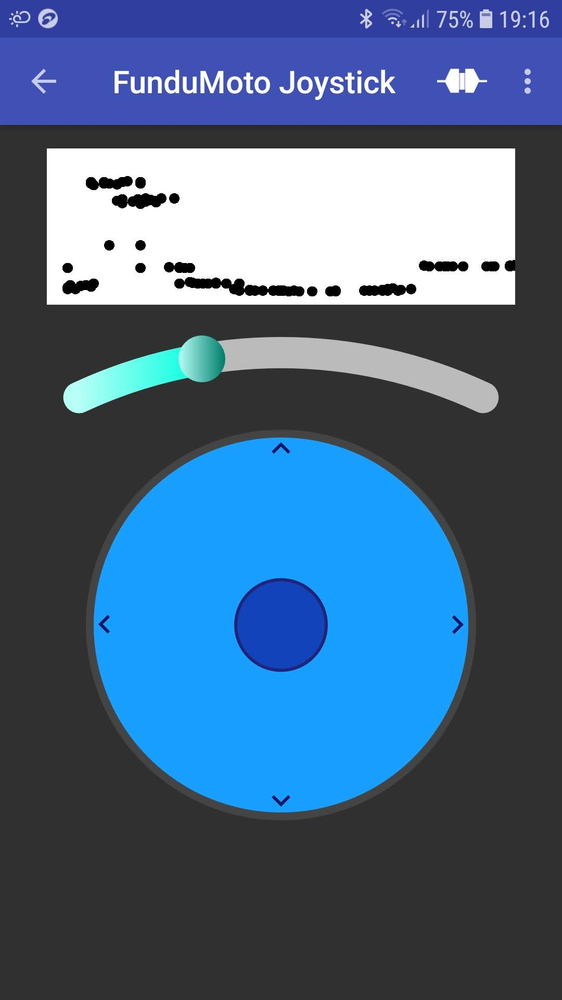
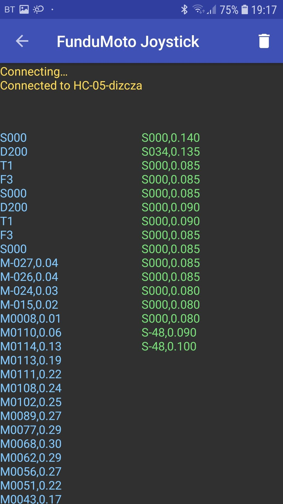

# FunduMotoJoystick

This app implements Bluetooth communication with [Nucleo F446RE + FunduMoto shield](https://github.com/dizcza/f446-FunduMoto). Based on https://github.com/kai-morich/SimpleBluetoothTerminal.

### UI

| Joystick | Logs |
|----------|------|
|||

### Features

* control robot's direction and speed with the joystick
* rotate servo with the slider
* received sonar distances are plot in the upper view
* sent (left panel) and received (right panel) Bluetooth messages are accessed via `Show Logs` menu
* change device settings (sonar max distance, sonar tolerance, etc.) in `Settings` menu
